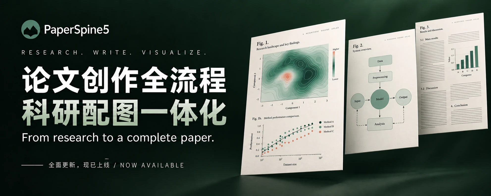

<p align="right"><a href="https://wubing2023.github.io/PaperSpine/v5/"></a></p>

<p align="center"><a href="https://wubing2023.github.io/PaperSpine/v5/"></a></p>

# PaperSpine5

> Release note: alpha.3 provides full Windows, Linux, and macOS suites only. The historical 0.70 MB Skill-only ZIP has no Web core or runtime and is not a current install option.

[中文](README.md) · [English](README.en.md) · [日本語](README.ja.md) · [한국어](README.ko.md) · [Español](README.es.md) · [Français](README.fr.md) · [Deutsch](README.de.md) · [Русский](README.ru.md) · [Português](README.pt.md)

[製品ページ](https://wubing2023.github.io/PaperSpine/v5/) · [GitHub Release](https://github.com/WUBING2023/PaperSpine/releases/tag/v0.4.0-alpha.3)

**PaperSpine5：ゼロから、図表までそろった論文をすばやく仕上げる。**

PaperSpine5 は、論文の全工程をカバーする AI Skill です。研究テーマ、手持ちの資料、実験データのいずれかを渡せば、文献調査、論点の整理、アウトライン作成、本文の執筆、科学図の作成、引用の検証、査読対応と修正、レイアウトまでを一通りこなし、編集可能な Word / LaTeX 原稿と PDF を納品します。

本文からデータ図、メカニズム図、手法フレームワーク図までを同じタスクの中で作ります。`paper-spine` で起動し、Web 画面で方針を選び、本文と図をプレビューし、修正点を伝えて成果物をダウンロードします。研究資料は原則として手元の環境に保存し、主張・引用・図表はすべて実在の資料と根拠に基づきます。

## ダウンロード

- Windows x64 suite：約 26.5 MB。
- Linux glibc x86_64 suite：約 56.2 MB。
- macOS Apple Silicon suite：約 40.6 MB。
- macOS Intel x86_64 suite：約 40.5 MB。

すべてのダウンロードは公開リリース一覧に掲載され、SHA-256 で照合できます。現在のバージョンは `v0.4.0-alpha.3` プレリリースです。

## インストールと旧バージョンからの移行

Windows x64：

```powershell
powershell -ExecutionPolicy Bypass -File .\install.ps1 -Target codex -CleanLegacy
```

macOS / Linux：

```sh
sh ./install.sh --target codex --clean-legacy
```

`-CleanLegacy` は既知の V3/V4 Skill 検出ディレクトリを退避するだけで、論文タスクのデータ、ホスト設定、未知のファイルは削除しません。どちらのインストーラーもバイト数、SHA-256、suite 内部の整合性、初回起動のセルフチェックを検証します。

## 更新の確認と適用

```powershell
# Windows
powershell -ExecutionPolicy Bypass -File .\install.ps1 -CheckOnly
powershell -ExecutionPolicy Bypass -File .\install.ps1 -Target codex
```

```sh
# macOS / Linux
sh ./install.sh --check-only
sh ./install.sh --target codex
```

インストーラーを再実行するとバージョンを確認します。新版があればタスクデータを保持して更新と起動確認を行い、ロールバックも可能です。最新版で Skill が揃っていれば、再ダウンロードや上書きは行いません。Skill を呼び出すたびに更新を確認し、必要なら suite と更新器を更新します。明示的に自動更新を無効にした設定は尊重します。

## 制約事項

- 自己完結型 suite は Windows x64、Linux glibc x86_64、macOS arm64、macOS x86_64 で検証済みです。Linux arm64 と musl/Alpine はサポート対象として宣言していません。
- macOS パッケージは署名も公証もされていないため、初回起動時にユーザーの明示的な許可が必要になる場合があります。
- 現在は alpha プレリリースであり、独立した暗号署名はありません。
- 製品の公開は、論文投稿、非公開資料のアップロード、支払い、外部への連絡を許可するものではありません。
- サポート窓口は任意の維持協力であり、機能の解放はなく、支払い状況も読み取りません。

## 公開リポジトリの構成

- `dist/codex/skills/paper-spine`、`dist/claude/skills/paper-spine`、`dist/openclaw/skills/paper-spine`：各ホストへの投影。
- `dist/claude/commands/paperspine.md`：Claude コマンドの入口。
- `install.ps1`、`install.sh`：インストール境界。
- 主要なメソッド／ツール：`writing_rationale_matrix`、`citation_support_bank`、`translation_package`、`artifact_check.py`、`reference_inventory.py`、`citation_bank_check.py`、`latex_guard.py`、`word_guard.py`。

## 開発

`src/` に Skill のソースコードがあり、`dist/` は各ホスト向けの公開投影です。公開リポジトリにはソースとテストのみを置き、ローカルのタスク、臨床データ、キャッシュ、開発時の実行ログは含めません。

MIT License.
