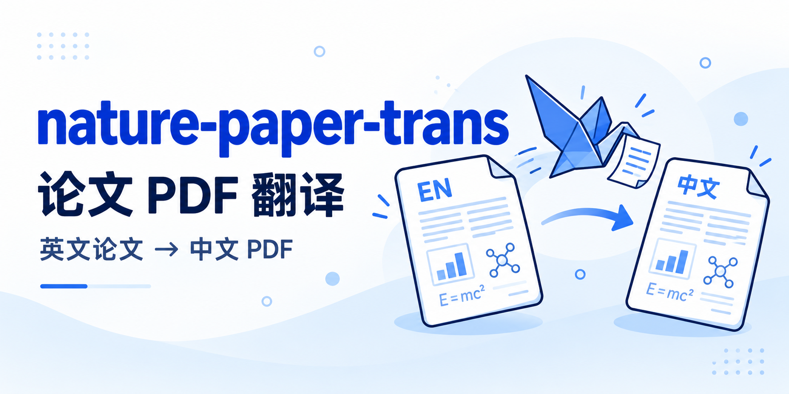

# nature-paper-trans

[English](README_EN.md)

将英文论文 PDF 的全文或指定页逐页生图翻译为简体中文图片型 PDF，默认保留源页面尺寸、方向和版式，尽量保留原有分栏、图表和页面布局。最终只交付中文 PDF。

## 适合用它做什么

- 翻译整篇论文，或只处理连续、不连续的页码。
- 在保留主要页面布局的前提下阅读中文译文。
- 使用指定术语或已确认译文；后续按用户明确选定的页码更新结果。

## 典型请求

> 使用 $nature-paper-trans 翻译这篇英文论文全文，输出中文 PDF。

> 使用 $nature-paper-trans 翻译第 1–3、5 页，术语按我提供的词表处理。

> 使用 $nature-paper-trans 更新上一份译文对应的原 PDF 第 3 页，重点保持右栏正文占位，并合并为新版本。

## 你需要提供

英文论文 PDF，以及可选的页码范围、术语表、保留名单或已确认译文。页码按从 1 开始的 **PDF 实际页序**计算，不按论文印刷页码计算；未指定范围时处理全文。

源 PDF 需清晰、可正常打开且未加密，不要求具备可提取的文字层。更新已有结果时，需提供原任务资料并明确要更新的原页码和要求。

## 产出

只交付一个中文 PDF：图片型，按原文页序排列；默认保留每个源页面的尺寸、方向和比例，图片在对应页面内等比例居中。只有用户明确要求时才统一转换为 A4。不生成或交付逐页检查 Markdown。

## 工作方式

**原 PDF 拆页 → 一次生图翻译 → 按原页序直接合并。**

各页共用一套提示词，由生图模型完成辨读、翻译和版式适配。每页在每次用户任务中只有一次生图机会，失败或结果不明也不自动重试。技能不执行生成后检查，不生成检查 Markdown；用户打开 PDF 肉眼查看，发现问题后再明确指定页码请求更新。

最多可并发提交 10 个未结束请求，实际并行与耗时取决于宿主工具和服务。中断后可接续原任务，复用已保存页面；用户明确选页后再开启新的更新任务。

## 运行和依赖

需要支持内置 `image_gen` 的 Codex、Python 3.9+、PyMuPDF 和 Pillow。脚本支持 macOS、Linux、WSL2 以及原生 Windows；原生 Windows 使用 PowerShell，WSL2 使用 Bash。依赖清单见 [requirements.txt](requirements.txt)。

在 Windows PowerShell 中，将示例里的 `$PYTHON` 替换为 `python` 或 `py -3`，并把路径写成带引号的 Windows 路径；流程和文件格式不变。原生 Windows 不要求额外安装 POSIX 文件锁库。

Python 脚本管理源页渲染、调用记录、图片保存和 PDF 合并；脚本本身不调用生图服务，也不生成检查说明。本技能独立运行，不依赖其他 Nature Skills 技能。

## 边界

- 输出不包含 OCR 文字层，不是可编辑 Word 或可搜索文本 PDF。
- 不承诺像素级 1:1 或逐字准确。生成结果可能存在错译、漏译、公式图表变化或局部版式偏差；基础对照不能代替逐字审校，关键数据与结论应对照原文。
- 确认缺页后，部分 PDF 标注实际包含的原页码；全部页面均无可用结果时不交付 PDF。
- 指定页更新失败时沿用已有可用结果。源 PDF 和已有成品不会被覆盖。

执行规则见 [SKILL.md](SKILL.md)，翻译与版式要求见 [通用提示词](references/image-translation-prompt.md)。

## 相关技能

- [nature-reader](https://github.com/Yuan1z0825/nature-skills/tree/main/skills/nature-reader)：需要全文 Markdown、中英文对照及来源锚点时使用。
- [nature-paper2ppt](https://github.com/Yuan1z0825/nature-skills/tree/main/skills/nature-paper2ppt)：需要中文论文汇报 PPTX 时使用。
